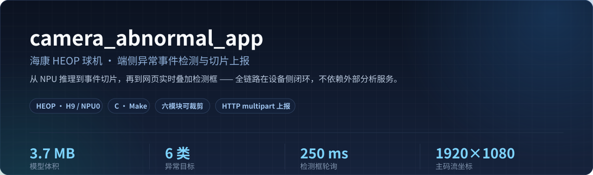
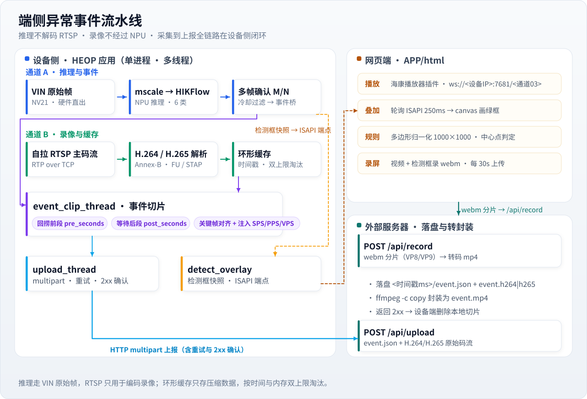
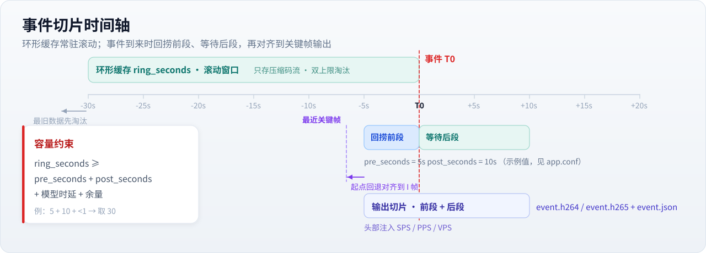

<div align="center">
  
</div>

<p align="center">
  <b>在海康 HEOP 球机上，把「NPU 异常检测 → 事件录像切片 → 上报 → 网页实时叠加」整条链路一次跑通。</b><br>
  推理不吃 RTSP、录像不占 NPU、切片在端侧完成 —— 设备只把切好的码流推给服务器。
</p>

---

## 目录

- [这是什么](#这是什么)
- [核心设计](#核心设计)
- [系统架构](#系统架构)
- [事件切片时间轴](#事件切片时间轴)
- [功能特性](#功能特性)
- [快速开始](#快速开始)
- [配置参考](#配置参考)
- [上报协议](#上报协议)
- [网页端](#网页端)
- [模型](#模型)
- [日志与排查](#日志与排查)
- [已知限制](#已知限制)
- [仓库结构](#仓库结构)
- [Roadmap](#roadmap)
- [许可证](#许可证)

## 这是什么

运行在海康 **HEOP 球机（H9 平台 / NPU0）** 上的异常事件检测应用：从 NPU 推理到
「事件录像切片 → 上报外部服务器 → 网页实时叠加检测框」的完整链路，全部在设备侧完成，
不依赖外部分析服务。

> 本 README 是仓库里唯一发布的文档。其余 `.md` 是本地的过程记录 / 调试手册，不入库。

## 核心设计

| 设计 | 为什么这么做 |
| --- | --- |
| **推理不解码 RTSP** | 推理走 VIN 原始帧（NV21），RTSP 只服务编码录像。两路互不干扰，编码压力不会拖慢推理。 |
| **环形缓存只存压缩数据** | 按时间与内存**双上限**淘汰，不放大内存占用。 |
| **切片在端侧闭环** | 前段回捞、后段等待、关键帧对齐、参数集注入全部在设备上完成；服务器只落盘 + `ffmpeg -c copy`，无须二次转码。 |
| **六模块可裁剪** | 推理 / 录像 / 切片 / 上报 / 老告警 / 网页叠加 六个开关任意组合，依赖关系由 `src/module_flags.h` 在**编译期**强校验，配错直接 `#error`。 |
| **换服务器只改一行** | 网页录屏的上报地址由检测端点下发（响应里的 `recordUrl`，从 `app.conf` 的 `upload_url` 派生），前端不写死 IP。 |

## 系统架构



设备侧是一个进程里的若干线程协作：

| 线程 | 主要文件 | 职责 |
| --- | --- | --- |
| 主线程 | `src/main.c` | 配置加载、信号处理、队列与环形缓存初始化、周期清理 |
| `infer_thread` | `src/infer_adapter.c` | 取 VIN 原始帧 → 预处理 → NPU 推理 → 多帧确认 → 发布异常事件与检测框快照 |
| `rtsp_record_thread` | `src/rtsp_client.c`、`src/ring_buffer.c` | 自拉 RTSP 主码流（RTP over TCP），解析 H264/H265 后写入带时间戳环形缓存 |
| `event_clip_thread` | `src/clip_writer.c` | 拼接事件前后片段、关键帧对齐、注入参数集、写 `.h264/.h265` + `event.json` |
| `upload_thread` | `src/uploader.c` | 上报与重试，收到 2xx 确认后按配置删除本地文件 |

## 事件切片时间轴



一次事件的完整时序是：环形缓存常驻滚动 → 检出异常时**回捞前段** → **等待后段**收齐 →
关键帧对齐（起点可能回退到更早的 I 帧）→ 注入 SPS/PPS/VPS → 落地切片。

容量约束（配置必须满足，否则前段会被环形缓存提前淘汰）：

```text
ring_seconds >= pre_seconds + post_seconds + 模型时延 + 余量
```

例如 `pre=5`、`post=10`、时延 <1s，取 `ring_seconds=30`。

## 功能特性

| 能力 | 说明 |
| --- | --- |
| NPU 异常检测 | VIN 原始帧 → mscale 预处理 → HIKFlow 模型推理（6 类），支持类别过滤、置信度阈值、规则区域、告警冷却、多帧确认去抖 |
| 事件录像切片 | 自拉 RTSP 主码流进带时间戳的内存环形缓存；事件发生时回捞前段、等后段、关键帧对齐、注入 SPS/PPS/VPS 后落地 |
| 事件上报 | HTTP `multipart/form-data` 上传 `event.json` + H264/H265 原始码流，带重试与 2xx 确认，确认成功才删本地文件 |
| 网页实时叠加 | 页面轮询应用自建的 ISAPI 端点，把检测框画在实时视频上；视频区可自适应窗口，不必再缩放浏览器 |
| 网页录屏上传 | 页面把「视频 + 检测框」录成 webm 分片上传，服务端转 mp4；上报地址由 `app.conf` 派生，前端不写死 IP |
| 模块化编译 | 推理 / 录像 / 切片 / 上报 / 老告警 / 网页叠加 六个开关可单独裁剪 |
| 启动自清理 | 可配置首次启动清理旧的 events 目录与失败残片，避免占满存储 |

## 快速开始

### 环境要求

- 具备 VIN / NPU / BSC 能力的海康 HEOP 设备（PC 上跑不起来）
- 设备侧 HEOP SDK：`/heop/include`、`/heop/lib`
- HEOP 开发容器（交叉编译工具链 `aarch64-mix210-linux-gcc`）

### 编译与打包

在 HEOP 开发容器里执行（非交互式 shell 要先 source 环境）：

```sh
for f in 001_toolchain.rc academy.rc app.rc dsp.rc; do . /etc/heop_devel_kit.rc/$f; done
sh makeapp.sh CC=aarch64-mix210-linux-gcc
# 成功 → output/cameraAbnormal_<版本>_H9.app
```

`makeapp.sh` 的流程：`make clean` → `make` → `make install`（把 vendor 下的模型 / 配置 / 数据
复制进 `APP/`）→ 校验 `APP/Model_P_NPU0.bin` 的输入格式 → `pack.sh` 打包 → 把 `.app` 移入 `output/`。

> **必须显式传 `CC=`**：宿主机自带 `cc` 会在第三方音频代码上因 `-Werror` 编译失败。

只编译不打包：

```sh
make CC=aarch64-mix210-linux-gcc
make install CC=aarch64-mix210-linux-gcc
```

### 裁剪模块

默认全开，按需关掉不需要的部分：

| Make 变量 | 默认 | 控制 | 依赖 |
| --- | --- | --- | --- |
| `ENABLE_INFER` | 1 | NPU 推理与异常事件 | — |
| `ENABLE_RING` | 1 | RTSP 拉流 + 环形缓存 | — |
| `ENABLE_CLIP` | 1 | 事件切片落盘 | 需要 `ENABLE_RING` |
| `ENABLE_UPLOAD` | 1 | 上报外部服务器 | 需要 `ENABLE_CLIP` |
| `ENABLE_LEGACY_ALARM` | 1 | 原 demo 的 JSON/JPEG 告警 | — |
| `ENABLE_DETECT_OVERLAY` | 1 | 检测框快照与网页叠加端点 | — |

例如只调 RTSP 与环形缓存、不初始化模型：

```sh
make CC=aarch64-mix210-linux-gcc ENABLE_INFER=0 ENABLE_CLIP=0 ENABLE_UPLOAD=0
```

依赖关系由 `src/module_flags.h` 在编译期强校验，配错直接 `#error`。

## 配置参考

设备端运行配置为 `app.conf`：

```ini
camera_id=ptz_001
rtsp_url=rtsp://127.0.0.1:554/ISAPI/Streaming/channels/101
upload_url=http://192.168.1.2:8080/api/upload
work_dir=/heop/package/cameraAbnormal/user_data/camera_abnormal
abnormal_classes=
confidence_threshold=0.0
pre_seconds=5
post_seconds=10
ring_seconds=20
ring_max_mb=16
```

完整键说明：

| 键 | 说明 |
| --- | --- |
| `camera_id` | 上报里的相机标识 |
| `rtsp_url` | 录像用主码流地址；`127.0.0.1` 会在运行时替换成 HEOP 提供的 BR0 地址 |
| `upload_url` | 事件上报地址（只支持普通 HTTP，不支持 HTTPS） |
| `work_dir` | 切片输出目录，建议指向持久化目录（`/heop/package/<App>/user_data/...`） |
| `hikflow_model_path` | 空 = 沿用 `hikflow_config.json` 的 `model_path` |
| `abnormal_classes` | 逗号分隔的异常类别；空 = 沿用 `sel_class`（`-1` 表示不过滤） |
| `confidence_threshold` | 低于该分数的目标直接丢弃（0 = 不过滤） |
| `pre_seconds` / `post_seconds` | 事件前 / 后保留时长 |
| `ring_seconds` / `ring_max_mb` | 环形缓存保留时长与内存上限 |
| `max_events` | 同时在处理的切片任务数上限 |
| `codec` / `fps` | `auto` 表示按 RTSP 协商结果决定 H264/H265 |
| `confirm_window_m` / `confirm_require_n` | 多帧确认：最近 `M` 帧里至少 `N` 帧检出才认为是真事件（`M` 上限 256，确认后窗口清零） |
| `cooldown_seconds` | 同一目标的告警冷却时间 |
| `upload_retry` / `upload_retry_interval_ms` | 上报重试次数与间隔 |
| `delete_after_upload` | 上报确认成功后删除本地视频与 JSON |
| `clear_events_once` | 首次启动清理固定 events 目录里的旧文件（一次性，执行后写标记） |
| `infer_interval_seconds` | `0` = 每帧都推理；`1` = 每秒最多一次（推理降频，VIN/RTSP 不受影响） |
| `debug_level` | `0` 关；`1` 打关键节点；`2` 追加队列与缓存的详细统计 |
| `test_event_interval_seconds` | 压测用：周期性伪造事件验证「录像→切片→上报」；**生产环境置 0** |
| `human_alarm_ip` / `human_alarm_port` | 原 demo 的 JSON/JPEG 告警接收端 |

## 上报协议

### 事件上报

设备上报（`POST /api/upload`）：

```http
POST /api/upload HTTP/1.1
Content-Type: multipart/form-data; boundary=----camera-abnormal-<ms>
Connection: close

--<boundary>
Content-Disposition: form-data; name="metadata"; filename="event.json"
Content-Type: application/json

{ "camera_id": "...", "event_type": "human_abnormal", "class_id": 2,
  "confidence": 0.87, "event_wall_ms": ..., "codec": "h265", "fps": 25,
  "packet_count": ..., "server_should_convert_mp4": true }
--<boundary>
Content-Disposition: form-data; name="video"; filename="event.h265"
Content-Type: application/octet-stream

<H264/H265 Annex-B 原始码流>
--<boundary>--
```

服务端落盘约定：

```text
<保存目录>/<接收时间戳ms>/
  event.json
  event.h264 | event.h265
  event.mp4            # 可选：ffmpeg -c copy 封装
```

服务端返回 2xx（例如 `{"ok":true}`）即视为上报成功，设备据此决定是否删除本地文件。

### 网页录屏

网页录屏走 `POST /api/record`：字段名为 `video`，内容是 webm 分片（无 metadata），
需要服务端转码成 mp4（webm 是 VP8/VP9 容器，`-c copy` 不可用）。

## 网页端

`APP/html/index.html` + `APP/html/script/main.js`：

- **视频**：用海康播放器插件（`script/playctrl/`）播放 `ws://<设备IP>:7681/<通道03>`，
  页面本身由设备的 Web 服务（80 端口）提供。
- **检测框叠加**：轮询 `GET /ISAPI/Custom/OpenPlatform/extern/cameraAbnormal/detections?format=json`
  （250ms，串行自调度），把归一化坐标 `[0,1]` 乘画布尺寸画出绿框；`pointer-events:none`
  保证不影响下层的规则多边形编辑。
- **规则区域**：在视频上画多边形，坐标归一化到 1000×1000 提交；目标框**中心点**落在
  多边形内才会触发事件与显示，与告警口径一致。
- **适应窗口**（默认勾选）：视频区用 CSS `transform: scale()` 等比缩放以适应窗口，
  **不改 1920×1080 的布局坐标系**。这样 canvas 的 `offsetX` 仍是元素自身坐标，
  规则绘制 / 拖动与检测框映射都不会错位（改成百分比尺寸就会错位）。
- **自动录制**：把视频 + 检测框画到 canvas 录成 webm，每 30s 上传一段。
  上报地址由设备下发：检测端点在响应根部返回 `recordUrl`（由 `app.conf` 的
  `upload_url` 派生，最后一段换成 `record`），页面优先使用它，**换服务器只改 app.conf**。

检测端点的响应示例：

```json
{
  "recordUrl": "http://192.168.1.2:8080/api/record",
  "cameraAbnormalDetections": {
    "seq": 1240, "ts": 1789620000000, "frameW": 1920, "frameH": 1080, "count": 1,
    "boxes": [
      { "x": 0.3120, "y": 0.2083, "w": 0.1458, "h": 0.4074,
        "cls": 0, "id": 1, "confidence": 0.87, "name": "person" }
    ]
  }
}
```

`seq` 每次发布递增，为 0 表示设备还没出过结果；`count` 为 0 表示目标离开。

## 模型

当前模型是自训练的 **6 类**检测模型：

| 索引 | 名称 | 索引 | 名称 |
| --- | --- | --- | --- |
| 0 | bird_nest（鸟窝） | 3 | smoke（烟雾） |
| 1 | balloon（气球） | 4 | kite（风筝） |
| 2 | plastic_bag（塑料袋） | 5 | sky_lantern（孔明灯） |

类别名只用于显示（设备预览文字 + 网页框标签）；`sel_class` / `abnormal_classes`
过滤的是**索引**。改名字直接改 `hikflow_attr.json`。

模型 BIN（`APP/Model_P_NPU0.bin`，约 3.7 MB）不入库，替换时注意三条：

1. **BIN 与自定义层必须成对替换**。模型的输出数量变了，`custom_layer/` 里的缓冲区尺寸
   也会跟着变（例如 8400 → 5040），只换 BIN 会直接跑不起来。
2. **输入格式必须是 NV21**（BIN 尾部 dev_info 偏移 45 处 == `2`）。`makeapp.sh` 会校验并
   拒绝打包。这个坑很隐蔽：格式不匹配时模型照样加载、NPU 照样跑，但一帧都不出框，
   日志里没有任何报错。
3. **预处理是整帧拉伸，不做 letterbox**。模型输入固定尺寸，设备把整帧直接缩放到该尺寸，
   与训练时的等比例填充存在固有畸变；用带 letterbox 的仿真脚本评估精度会得到错误结论。

## 日志与排查

- 运行日志走 stderr，`debug_level=1/2` 决定详细程度；启动时会打印生效配置与模块开关。
- 检测框链路有一条**不受 `debug_level` 影响**的 ERR 级日志，每秒最多一行、目标数变化时必打：

  ```text
  detect overlay: n=1 frame=1920x1080 ts=... box0=(...) cls=0 id=1 name=...
  ```

  `n=0` 说明后端没出框（不是前端问题）；这行完全不出现说明推理没起来。
- 网页不画框但日志有 `n>0`：先确认网页播的是**哪个码流**——检测框是通过
  `opdevsdk_pos_setProcType(chan, stream, AFTER_ENC)` 打进指定码流的，网页播放的通道号
  必须与打进 POS 的流号一致，否则推理正常、日志正常、就是没框。
- 上传失败会按 `upload_retry` 重试，失败残片由启动清理处理。

## 已知限制

- 必须在具备 VIN / NPU / BSC 能力的 HEOP 设备上运行，PC 上跑不起来。
- 需要设备侧的 HEOP SDK（`/heop/include`、`/heop/lib`）才能编译。
- 上报只支持普通 HTTP。
- 检测框只在网页（POS 元数据）与设备预览上显示；客户端软件是否显示取决于其 POS 支持。

## 仓库结构

```text
src/                          应用自身代码（配置 / 环形缓存 / RTSP / 切片 / 上报 / 网页叠加）
vendor/human_detect_demo_v2/  海康 HIKFlow 检测 demo（第三方）：算法、协议、自定义层
APP/                          打包目录
  META-INFO/                  应用元信息（包名、版本、入口脚本、跳转页面）
  cameraAbnormal.sh           启动脚本（做软链、设 LD_LIBRARY_PATH、拉起主程序）
  html/                       网页（index.html + script/main.js 是本项目改的）
Makefile / makeapp.sh         编译与打包
app.conf                      设备端运行配置
check_model_bin.py            校验模型 BIN 的输入格式（打包时的守门人）
```

`APP/` 里的二进制、模型、`data/`、`libusr_trans.so` 都是 `make install` 的产物，
不入库（见 `.gitignore`）。`.gitignore` 排除的主要内容：

| 类别 | 路径 | 为什么 |
| --- | --- | --- |
| 过程文档 | 除 `README.md` 外的所有 `*.md`、`先看这里.txt` | 本地调试记录，随时过期，不适合公开 |
| 外部接收端 | `server/`（FastAPI 版）、`server_qt/`（Qt 版） | 本地调试工具，不属于设备端应用 |
| 本地配置 | `Ultralytics/` | 里面是本机绝对路径 |
| 主机侧单测 | `tests/` | 用本机 gcc 跑的单元测试，不参与设备构建 |
| 安装包 | `output/`、`APP/*.app` | 构建产物，约 13 MB |
| 误提交产物 | 根目录 `camera_abnormal_app`、`.module-flags` | 编译生成，不该入库 |
| APP 生成物 | `APP/Model_P_NPU0.bin`、`APP/data/`、`APP/libusr_trans.so*`、`APP/hf_dbg`、`APP/app.conf`、`APP/hikflow_*.json`、`APP/test.*` | `make install` 会从 vendor 重新复制 |
| Python 缓存 | `*.pyc`、`__pycache__/`、`.venv/` | 本地环境 |

唯一保留的 Python 文件是 `check_model_bin.py`（模型格式守门人），已在 `.gitignore` 里用
`!check_model_bin.py` 例外放行。

> 注意：`.gitignore` 只对未跟踪文件生效。要确认清理结果，用 `git status` 与
> `git ls-files` 对照；历史上已经 push 过的大文件如果要从历史里彻底删除，
> 需要重写历史（`git filter-repo` / BFG）后强推，并让协作者重新克隆。

## Roadmap

以下方向由「已知限制」直接推导而来，欢迎用 issue / PR 讨论优先级：

- [ ] 上报支持 HTTPS 与鉴权头（当前仅普通 HTTP）
- [ ] 断网时的本地续传队列（现在失败残片依赖启动清理）
- [ ] 设备参数热更新（当前改 `app.conf` 需重启进程）
- [ ] 把主机侧单测 `tests/` 收回仓库，给切片 / 环形缓存 / RTP 解析加回归测试
- [ ] 清理仍在跟踪的编译产物（`src/**/*.o`、`vendor/**/*.o`、`hf_dbg`、`.nv21` 测试帧，合计约 6.7 MB）
- [ ] 多路相机 / 多模型切换

## 许可证

当前仓库尚未附带授权协议（没有 `LICENSE` 文件），在补充之前默认保留所有权利。
如果计划长期开源，建议补一份（例如 Apache-2.0 或 MIT），并在 README 顶部挂上对应的 badge。
